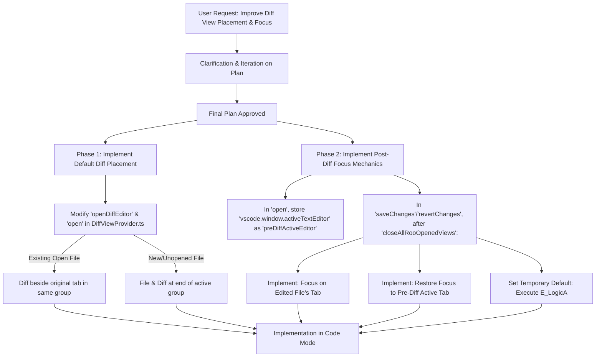

# Plan: Diff View Placement and Focus Enhancements

**Objective:** Modify `src/integrations/editor/DiffViewProvider.ts` to implement a new default diff view placement behavior and the underlying mechanics for two distinct post-diff focus behaviors, with one set as a temporary hardcoded default. No new settings will be added in this iteration.

**1. Implement Default Diff View Placement Logic:**
_ **File:** `src/integrations/editor/DiffViewProvider.ts`
_ **Methods to Modify:** Primarily `openDiffEditor()`, with potential adjustments in `open()` for context or to pass necessary information.
_ **Placement Behavior:**
_ **For existing, currently open files:**
_ The diff view (`vscode.diff` command) should be opened in the same editor group as the original file's tab.
_ The diff view should appear immediately beside the original file's tab. This will likely involve:
_ Identifying the `ViewColumn` of the original file's tab.
_ Ensuring the original file's tab is the active tab within its group _before_ calling `vscode.diff`.
_ Using the original tab's `ViewColumn` in the `TextDocumentShowOptions` for `vscode.diff`.
_ **For new files or existing files that are not currently open:**
* The new file tab (if applicable) and its associated diff view should open at the end of the *currently active* editor group.
* This typically means using `ViewColumn.Active` (or the `viewColumn` passed to the `open()` method, which defaults to `ViewColumn.Active` if not specified by the caller) and ensuring `preview: false`.

**2. Implement Mechanics for Two Post-Diff Focus Behaviors:**
_ **File:** `src/integrations/editor/DiffViewProvider.ts`
_ **Store Pre-Diff Active Editor:**
_ In the `open()` method, before opening the diff view, capture and store a reference to `vscode.window.activeTextEditor` (e.g., in a new private member `this.preDiffActiveEditor`).
_ **Modify Focus Logic in `saveChanges()` and `revertChanges()`:**
* This logic will execute *after* all Roo-opened views (including the diff view itself) are closed by `closeAllRooOpenedViews()`.
* **Implement Behavior A (Focus on Edited File):**
_ If the file represented by `this.relPath` is still open as a tab, find its `vscode.Uri`.
_ Make this tab active using `vscode.window.showTextDocument(uri, { preserveFocus: false, preview: false, viewColumn: /* its current viewColumn */ })`.
_ **Implement Behavior B (Focus on Pre-Diff Active Tab):**
_ Check if `this.preDiffActiveEditor` and `this.preDiffActiveEditor.document` are still valid (e.g., the tab hasn't been closed by the user).
_ If valid, attempt to restore focus using `vscode.window.showTextDocument(this.preDiffActiveEditor.document.uri, { preserveFocus: false, preview: false, viewColumn: this.preDiffActiveEditor.viewColumn })`.
_ **Temporary Default:** For this task, the code will be structured to execute **Behavior A (Focus on Edited File)** as the default. The logic for Behavior B will be implemented but conditionally skipped.

**3. No New Settings:**
* No changes to `package.json` or the `_readDiffSettings()` method for new configuration options. The existing `autoFocus` setting will still be respected where relevant (e.g., initial focus *within\* the diff editor panes).

**Workflow Diagram (Final):**

