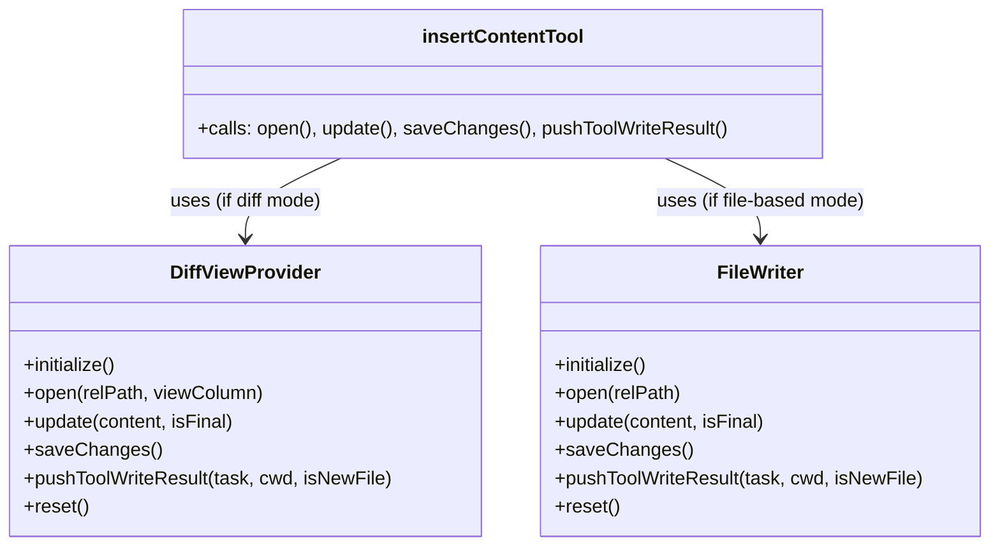

# File-Based Editing Backend Implementation Plan

## Goal

- Implement a new `FileWriter` class in `src/integrations/editor/` for direct file editing (no diff view).
- Integrate this class into tool logic (e.g., `insertContentTool`) so the correct editing strategy is chosen based on the user's settings.
- Mirror the API and structure of `DiffViewProvider` for consistency and easy swapping.
- **User approval/interaction should be handled exactly as with DiffViewProvider.**
- **FileWriter should only write to disk, never open files in the editor.**

---

## 1. FileWriter Class Design

**Location:**  
`src/integrations/editor/FileWriter.ts`

**Responsibilities:**

- Directly write to files in the workspace (create, modify, insert, etc.).
- Handle all file-system-based editing operations (no VSCode diff, no decorations, no tab management).
- Provide a similar API to `DiffViewProvider` for easy integration and swapping.
- Handle diagnostics and user feedback (e.g., problems after write).
- Never open files in the editor.

**Key Methods:**

- `initialize()`: (optional) Prepare any state if needed.
- `open(relPath: string)`: Prepare for editing (e.g., check existence, create dirs).
- `update(content: string, isFinal: boolean)`: Write content to file (atomic write).
- `saveChanges()`: Finalize the write, return diagnostics and summary.
- `pushToolWriteResult(task, cwd, isNewFile)`: Format and send feedback, similar to DiffViewProvider.
- `reset()`: Clean up any state.

**Settings Integration:**

- Reads settings from VSCode config (e.g., openTabsInCorrectGroup, openTabsAtEndOfList).
- Honors file-based editing toggle.

---

## 2. Integration with Tool Logic

**insertContentTool and Others:**

- Before using `DiffViewProvider`, check the current settings (from VSCode config or global state).
- If file-based editing is enabled, use `FileWriter` instead of `DiffViewProvider`.
- The tool logic should be agnostic to which provider is used (polymorphic API).
- User approval/interaction must be handled the same as with DiffViewProvider.

---

## 3. Settings Handling

- Read the new settings (`fileBasedEditing`, `openFilesWithoutFocus`, etc.) from VSCode config in the provider.
- Use these settings to control file writing behavior.

---

## 4. Diagnostics and Feedback

- After writing, collect diagnostics (errors/warnings) for the file.
- Format and return feedback in the same way as `DiffViewProvider` (XML, say objects, etc.).

---

## 5. Testing

- Unit tests for `FileWriter` (high-level only, as per guidelines).
- Integration test for tool logic to ensure correct provider is chosen and used.

---

## 6. User Experience

- **User approval/interaction is required before writing, just like with diff-based editing.**
- **FileWriter never opens files in the editor after writing.**

---

## Mermaid Diagram: Class/Flow Overview

---

## Steps

1. **Create `FileWriter.ts`** in `src/integrations/editor/` with the API above.
2. **Implement all methods** to perform direct file writes, diagnostics, and feedback.
3. **Update `insertContentTool.ts`** and any other tool logic to select the provider based on settings.
4. **Read settings** from VSCode config in `FileWriter`.
5. **Write high-level tests** for `FileWriter` and provider selection logic.
6. **Document** the new class and its usage.

---

**User approval/interaction is required before writing, just like with diff-based editing.  
FileWriter never opens files in the editor after writing.**
