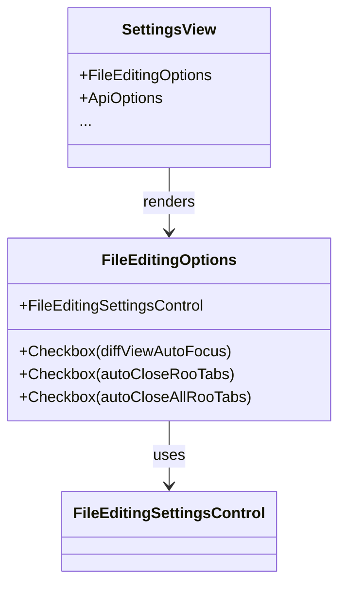

# Plan: Extract File Editing Options to a New Component

## Goal

- Extract the following settings from `ApiOptions.tsx`:
    - `diffViewAutoFocus`
    - `autoCloseRooTabs`
    - `autoCloseAllRooTabs`
    - `fileBasedEditing` (currently handled by `FileEditingSettingsControl`)
- Move them into a new component: `FileEditingOptions.tsx`
- Use `FileEditingSettingsControl.tsx` as a base for the new component.
- Integrate the new component into `SettingsView.tsx` under the {/_ File Editing Section _/}, similar to the Providers section.

---

## 1. Extract Settings Logic

**From:**

- `ApiOptions.tsx` (currently passed to `DiffSettingsControl` and `FileEditingSettingsControl`)

**To:**

- New file: `webview-ui/src/components/settings/FileEditingOptions.tsx`

**Settings to Extract:**

- `diffViewAutoFocus`
- `autoCloseRooTabs`
- `autoCloseAllRooTabs`
- `fileBasedEditing` (move from `FileEditingSettingsControl`)

---

## 2. New Component: FileEditingOptions

**File:**  
`webview-ui/src/components/settings/FileEditingOptions.tsx`

**Responsibilities:**

- Render controls for all file editing-related settings.
- Use the same onChange pattern as other settings controls.
- Use `FileEditingSettingsControl` as a base for file-based editing and related toggles.
- Add new controls for `diffViewAutoFocus`, `autoCloseRooTabs`, `autoCloseAllRooTabs` (checkboxes with labels/descriptions).
- Group all file editing settings in a visually clear section.

**Props:**

- All relevant settings as props (booleans)
- `onChange` handler for updating settings

**Structure Example:**

```tsx
<FileEditingOptions
	diffViewAutoFocus={apiConfiguration.diffViewAutoFocus}
	autoCloseRooTabs={apiConfiguration.autoCloseRooTabs}
	autoCloseAllRooTabs={apiConfiguration.autoCloseAllRooTabs}
	fileBasedEditing={apiConfiguration.fileBasedEditing}
	openFilesWithoutFocus={apiConfiguration.openFilesWithoutFocus}
	openTabsInCorrectGroup={apiConfiguration.openTabsInCorrectGroup}
	openTabsAtEndOfList={apiConfiguration.openTabsAtEndOfList}
	onChange={setApiConfigurationField}
/>
```

---

## 3. Update SettingsView.tsx

- Import and render `<FileEditingOptions />` in the {/_ File Editing Section _/} of `SettingsView.tsx`.
- Remove the old `DiffSettingsControl` and `FileEditingSettingsControl` from the Providers section in `ApiOptions.tsx`.
- Ensure the new section is visually consistent with the Providers section.

---

## 4. Update ApiOptions.tsx

- Remove all file editing-related settings and controls from `ApiOptions.tsx`.
- Only keep provider/model-specific settings in this component.

---

## 5. i18n and Descriptions

- Ensure all labels and descriptions use the translation keys from `settings.json`.
- If any new keys are needed, add them to `webview-ui/src/i18n/locales/en/settings.json`.

---

## 6. Testing

- If there are existing tests for `FileEditingSettingsControl`, use them as a reference for the new component.
- Add/adjust tests for the new `FileEditingOptions` component.

---

## 7. Visual/UX Consistency

- Use the same Tailwind and VSCode variable classes as the rest of the settings UI.
- Group toggles and controls logically (e.g., diff-related, file-based editing, tab behavior).

---

## Mermaid Diagram: Component Structure



---

## Steps

1. **Create `FileEditingOptions.tsx`** with all relevant controls.
2. **Move logic/props** for file editing settings from `ApiOptions.tsx` to the new component.
3. **Update `SettingsView.tsx`** to render the new section.
4. **Remove old controls** from `ApiOptions.tsx`.
5. **Update i18n** as needed.
6. **Test** the new component and integration.
