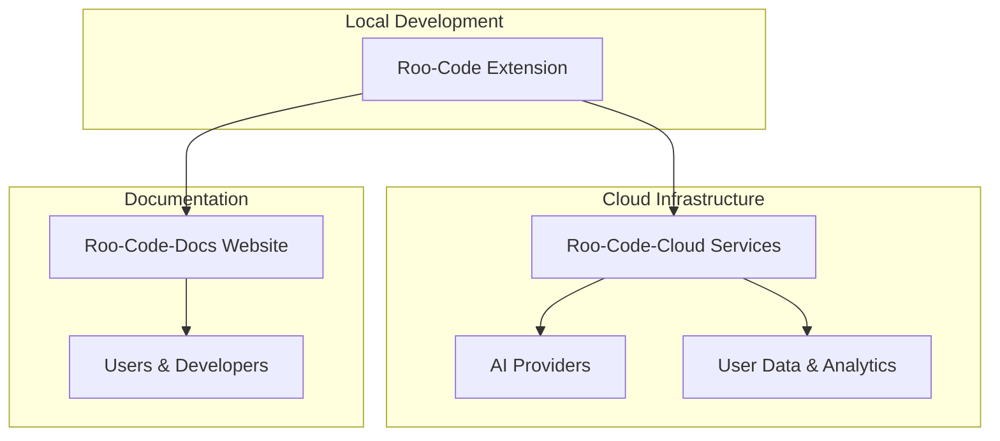

# Git Repository Analysis

This document provides a comprehensive overview of the git repositories found in the current working directory, explaining the purpose and contents of each repository.

## Overview

There are **3 main git repositories** in the current directory:

1. [`Roo-Code/`](Roo-Code/) - The main VS Code extension
2. [`Roo-Code-Cloud/`](Roo-Code-Cloud/) - Cloud infrastructure and services
3. [`Roo-Code-Docs/`](Roo-Code-Docs/) - Documentation website

---

## 1. Roo-Code Repository

**Location:** [`Roo-Code/`](Roo-Code/)  
**Type:** VS Code Extension  
**Technology Stack:** TypeScript, Node.js, VS Code Extension API  
**Package Manager:** pnpm  

### Purpose
This is the main repository for **Roo Code**, an AI-powered autonomous coding agent that runs as a VS Code extension. It serves as an intelligent coding assistant that can communicate in natural language, read/write files, run terminal commands, and automate browser actions.

### Key Features
- **Multiple AI Provider Support**: Integrates with OpenAI-compatible APIs and custom models
- **Multiple Modes**: Code, Architect, Ask, Debug, and Custom Modes for specialized tasks
- **Smart Tools**: File operations, terminal commands, web browser control
- **MCP Integration**: Model Context Protocol for extending capabilities
- **Customization**: Custom instructions, modes, local models, and auto-approval settings

### Repository Structure
- **`src/`**: Main extension source code including [`extension.ts`](Roo-Code/src/extension.ts) (entry point)
- **`webview-ui/`**: User interface components for the VS Code webview
- **`packages/`**: Shared packages and utilities
- **`apps/`**: Application components
- **`locales/`**: Internationalization files (supports 15+ languages)
- **`scripts/`**: Build and development scripts

### Development
- **Node.js Version**: 20.19.2
- **Build System**: Turbo monorepo with TypeScript
- **Testing**: Vitest framework
- **Distribution**: Published to VS Code Marketplace as VSIX packages

---

## 2. Roo-Code-Cloud Repository

**Location:** [`Roo-Code-Cloud/`](Roo-Code-Cloud/)  
**Type:** Cloud Infrastructure Monorepo  
**Technology Stack:** TypeScript, Node.js, Docker, PostgreSQL, ClickHouse, Redis  
**Package Manager:** pnpm  
**Deployment:** Fly.io  

### Purpose
This repository contains the cloud infrastructure and backend services that power Roo Code's cloud features. It's a comprehensive monorepo that includes multiple microservices, APIs, dashboards, and deployment tools.

### Key Components

#### Applications (`apps/`)
- **`web/`**: Main web application and dashboard
- **`roomote-api/`**: Core API service for Roomote (remote execution service)
- **`roomote-controller/`**: Service controller and orchestration
- **`roomote-dashboard/`**: Administrative dashboard
- **`roomote-worker/`**: Background job processing and AI agent execution
- **`roomote-cli/`**: Command-line interface for management
- **`roomote-deployer/`**: Deployment automation tools
- **`provider-proxy/`**: API proxy for AI providers
- **`extension-bridge/`**: Bridge service between VS Code extension and cloud
- **`dev/`**: Development environment setup

#### Infrastructure
- **Database Stack**: PostgreSQL (primary data), ClickHouse (analytics), Redis (caching)
- **Containerization**: Docker Compose for local development
- **Deployment**: Fly.io with automated CI/CD
- **Security**: Encrypted environment variables using dotenvx

### Development Environment
- **Node.js Version**: 22.x
- **Database Setup**: Automated with `pnpm db:up`
- **Local Development**: `pnpm dev` starts all services
- **Environment Management**: Encrypted `.env` files for different environments

### Key Features
- **Multi-tenant Architecture**: Supports multiple organizations and users
- **Real-time Communication**: WebSocket connections for live updates
- **Analytics**: ClickHouse-powered analytics and monitoring
- **Scalable Deployment**: Microservices architecture on Fly.io
- **Development Tools**: Comprehensive CLI and deployment automation

---

## 3. Roo-Code-Docs Repository

**Location:** [`Roo-Code-Docs/`](Roo-Code-Docs/)  
**Type:** Documentation Website  
**Technology Stack:** Docusaurus, React, TypeScript  
**Package Manager:** npm  
**Deployment:** Static site hosting  

### Purpose
This repository contains the official documentation website for Roo Code, built with Docusaurus. It serves as the comprehensive user guide and developer documentation.

### Website URL
**Live Site:** [https://docs.roocode.com](https://docs.roocode.com)

### Content Structure
- **`docs/`**: Main documentation content
  - **`getting-started/`**: Installation and setup guides
  - **`basic-usage/`**: Core functionality documentation
  - **`advanced-usage/`**: Advanced features and customization
  - **`features/`**: Detailed feature explanations
  - **`providers/`**: AI provider integration guides
  - **`roo-code-cloud/`**: Cloud service documentation
  - **`update-notes/`**: Release notes and changelogs

### Key Features
- **Modern Documentation**: Built with Docusaurus v3
- **Search Functionality**: Local search with `@easyops-cn/docusaurus-search-local`
- **Analytics**: PostHog integration for usage tracking
- **Responsive Design**: Mobile-friendly documentation
- **Code Highlighting**: Syntax highlighting for multiple languages

### Development
- **Node.js Version**: 18+
- **Local Development**: `npm start` for live preview
- **Build**: `npm run build` for production
- **Deployment**: Static site generation

---

## Repository Relationships

## Summary

These three repositories form a complete ecosystem:

1. **Roo-Code**: The core VS Code extension that users interact with directly
2. **Roo-Code-Cloud**: The backend infrastructure that powers cloud features, analytics, and multi-user capabilities
3. **Roo-Code-Docs**: The documentation that helps users understand and effectively use the platform

Together, they provide a comprehensive AI-powered coding assistant platform with local and cloud capabilities, extensive documentation, and enterprise-grade infrastructure.